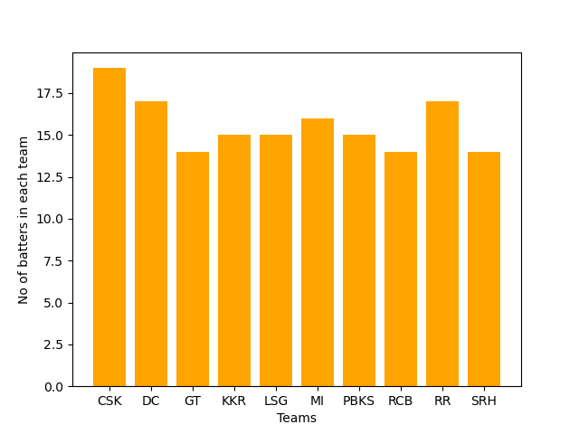

GP-Project-IPL-Dataset

An interactive data analysis project on IPL Batters’ Performance (2025 season).
This project uses Python and Jupyter Notebook to explore batting data, generate insights, and visualize trends.

📂 Repository Contents

IPL2025Batters.csv – Dataset containing IPL batters’ statistics

main.ipynb – Jupyter notebook for data loading, cleaning, EDA, and visualization

requirements.txt – Python dependencies

images/ – Folder containing output plots used in this README

⚡ Features

✔️ Load and explore IPL dataset
✔️ Perform EDA with pandas, matplotlib, seaborn
✔️ Generate visualizations (bar charts, scatter plots, histograms, etc.)
✔️ Insights on batting performance: runs, strike rates, averages

🛠️ Installation
# Clone the repo
git clone https://github.com/NithyaShriSK/GP-project-IPL-dataset-.git
cd GP-project-IPL-dataset-

# Create virtual environment
python -m venv venv
source venv/bin/activate   # Windows: venv\Scripts\activate

# Install dependencies
pip install -r requirements.txt

# Launch notebook
jupyter notebook

🚀 Usage

Open main.ipynb

Run cells step by step to:

Load & clean data

Perform exploratory analysis

Generate visualizations

Interpret results

📊 Example Outputs

Here are 5 sample outputs from the notebook:

1. Highest Runs scored by each team

2. Number of Batters per each team

3. Teamwise_StikeRate

4. Total_50s_per Team

5. Total_100s_per_team

📌 Data Overview
Column	Description
Player	Batter’s name
Matches	Matches played
Runs	Total runs scored
StrikeRate	Batting strike rate
Average	Batting average

(Update based on your dataset columns)

✅ Recommendations

Add .gitignore to exclude venv/

Provide dataset source info (e.g., Kaggle or official IPL site)

Keep adding more visualizations & analysis

Save all plots into images/ for documentation

📜 License

This project is open-source. You may freely use and modify it for educational purposes.